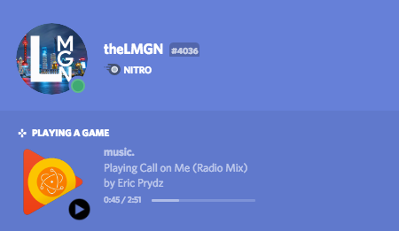

# ! DEPRECIATED !

Use GDPMP's built in thingy

# playcord `0.0.1`
**Display your current GPMDP song on Discord using the RPC API:**

## Dependencies
  - NodeJS >=8
  - npm (>=5)
  - Discord Canary (preferred)
  - Google Play Music Desktop Player

## Setup
  - Download Node.JS from https://nodejs.org/en/ (both versions *should* work)
  - [Download the repo and unzip](https://github.com/theLMGN/Playcord/archive/master.zip)
  - Open CMD/Terminal
  - Find the directory where you extracted it. (type `cd ~/Downloads/Playcord-master` for macOS and Linux and `cd %homepath%\Downloads\Playcord-master` if you extracted it with the default name to your downloads folder)
  - Type `npm install`
  - Once that completes setup is done. Type `node app.js` whenever you want to use it.
  
### Video Tutorals
  - [Tutorial by Sam Menzies](https://youtu.be/Rntn6Jg8cHk?t=210)

## Useful links

* [RPC API Documentation](https://discordapp.com/developers/docs/topics/rpc)
* [Rich Presence Documentation](https://discordapp.com/developers/docs/rich-presence/how-to)

## Troubleshooting
### It says the song is being updated but it isn't being displayed on my profile?
  - Go to Discord settings
  - Go to "Games"
  - Make sure "Display currently running game as a status message" is ticked

### Invalid token function (or something similar)
  - Make sure your node is updated, you need at LEAST version 8.0.0!

### `stdout maxBuffer exceeded` or some XML/CSV parse error
  - This is due to an outdated library which tries to help with Windows support
  - Go to node_modules, go to wintools, go to lib
  - Open ps.js
  - On line 11, replace the whole line with:
  `exec('wmic process list /format:csv', {maxBuffer: 2000*1024}, function (err, stdout, stderr) {`

### How to run in the background
  - Install pm2 `npm i pm2 -g`
  - Start the app `pm2 start app.js --name="playcord"`
  - Use `pm2 log playcord` to view the logs
  - Restart the app using `pm2 restart playcord`
